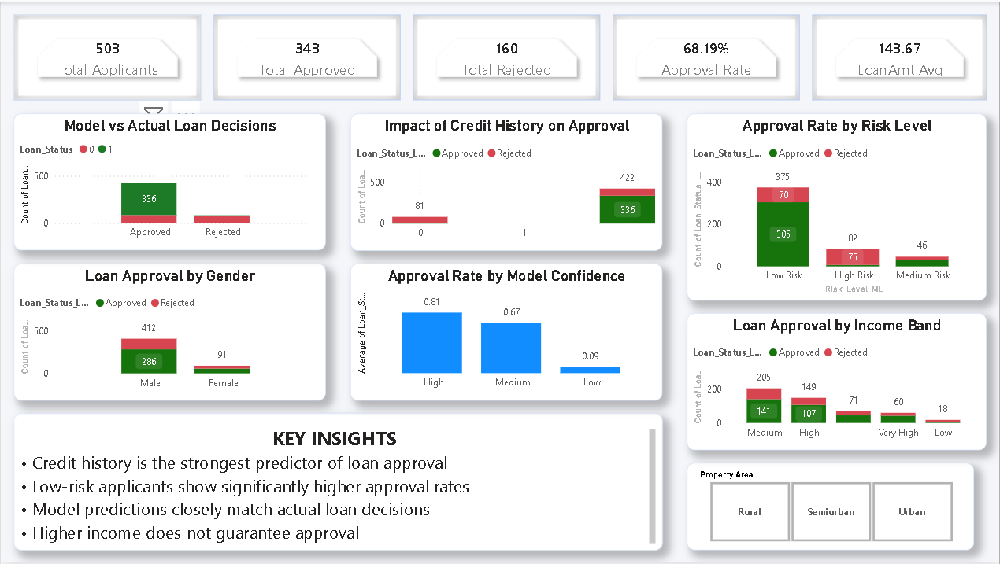

# 📊 Loan Approval Analysis Dashboard

## 🔍 Overview
This project analyzes loan approval data to identify key factors that influence whether a loan is approved or rejected. The workflow includes data cleaning using Python and building an interactive dashboard in Power BI.

---

## ⚙️ Tools & Technologies
- Python (Pandas, NumPy, Matplotlib, Seaborn)
- Power BI
- Jupyter Notebook

---

## 📊 Dashboard (Preview)

---

## 📈 Key Insights
- Credit history is the most significant factor influencing loan approval  
- Applicants with poor credit history have a much higher rejection rate  
- Income alone does not guarantee loan approval  
- Higher loan amounts slightly increase the chances of rejection  

---

## 🧠 Project Workflow
1. Data cleaning and preprocessing using Python  
2. Handling missing values using median (numerical) and mode (categorical)  
3. Feature understanding and exploratory data analysis  
4. Building an interactive Power BI dashboard  
5. Creating KPIs such as:
   - Total Applicants  
   - Approval Rate  
   - Average Loan Amount  

---

## 📁 Files in this Repository
- `cleaned_loan_data.csv` → Cleaned dataset  
- `loan_analysis.ipynb` → Python data analysis and preprocessing  
- `loan_dashboard.pbix` → Power BI dashboard file  

---

## 🚀 Future Improvements
- Add a machine learning model to predict loan approval  
- Improve dashboard design with advanced Power BI features  
- Add more feature-based analysis  

---

## 📌 How to Use
1. Open the `.pbix` file in Power BI Desktop  
2. Explore the dashboard using filters  
3. Run the notebook to understand data cleaning and analysis  

---

## 👤 Author
- Unnati Bhanushali
